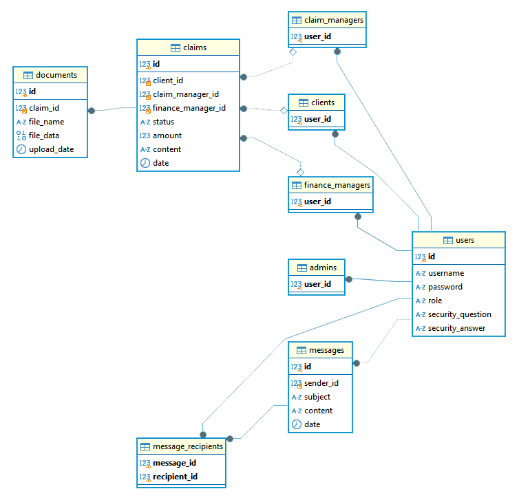

# Scrum Insurance
Welcome to our Scrum Insurance Claim Management System (ICMS)

## Demo

## Design

The ICMS is an end-to-end system for communication of insurance claim infromation between users.

### Front-End

- A login form takes you to the landing page for your account's role.
- Clients fill out claim applications with a claim overview and supporting documents.
- Claim Managers view claims, verify policy coverage, and deny or transfer to finance.
- Finance Managers view claims, decide amount of coverage, and message client with info.
- Admins manage all other users accounts through modification of username, password, and role.

### Controller
- Through our ScrumUserControl extension class, all controls have access to the Session and DatabaseController objects.
- Logged in user account information is stored in the Session object.
- DatabaseController serves as the middleware for passing query data to front-end.

### Database
- Data is stored on our MySQL server on Butler's database.
- Every table is in third normal form (3NF) to minimize data redundancy.

#### Naming and Data Type Conventions
- Column names are in snake case
- IDs are int(10) unsigned
- Dates are all datetime
- Document file data is stored as a LONGBLOB
#### Functionality
- User supertype table has subtypes for each user role
- Multiple documents can be associated with a claim.
- The message recipients table allows messaages to have multiple receivers.

#### Entity Relationship Diagram

